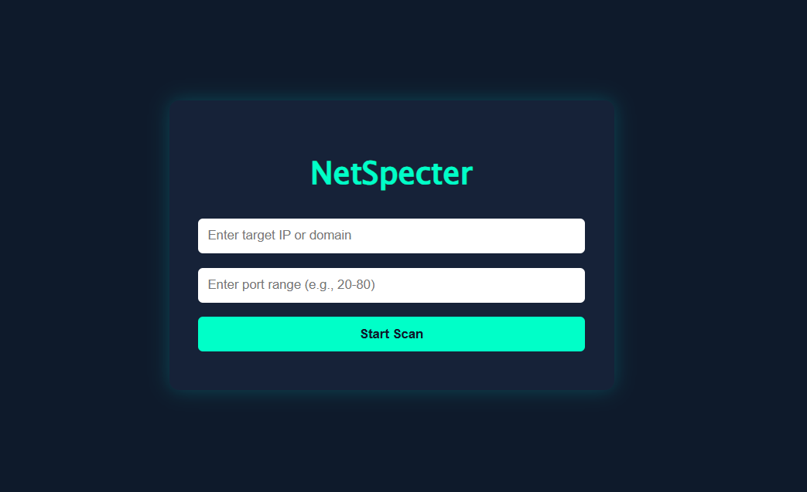

# 🔒 Port Scanner Web Tool

A simple yet effective web-based port scanning tool built using Python and Flask. This tool allows users to scan a range of ports on a given domain name or IP address and visually displays the open ports on the frontend.

---

## 📸 Demo Screenshot



---

## 🚀 Features

- Scan open ports on any IP address or domain
- Accepts custom port ranges like `1-100` or `20-25`
- Responsive user interface built with HTML, CSS, and JavaScript

---


## 🛠️ Setup Instructions

Follow these steps to set up and run the project locally:

1. Clone the repository

```bash
git clone https://github.com/satyamsrivastava1207/Port-Scanner-Tool.git
cd Port-Scanner-Tool
```


2. Create a virtual environment (Recommended)

python -m venv venv
# On Windows
venv\Scripts\activate
# On macOS/Linux
source venv/bin/activate


3. Install dependencies 

```bash
pip install -r requirements.txt
```
    If requirement.txt is missing, manually install Flask:
    
    pip install Flask


4. Run the Flask app
```bash
python app.py
```

Now, open your browser and navigate to:
http://localhost:5000

---
Dependencies:
This project uses the following libraries:

Flask — for serving the backend

socket — for low-level network port scanning (built-in)


---
Created by Satyam Srivastava
Github: @satyamsrivastava1207
---
